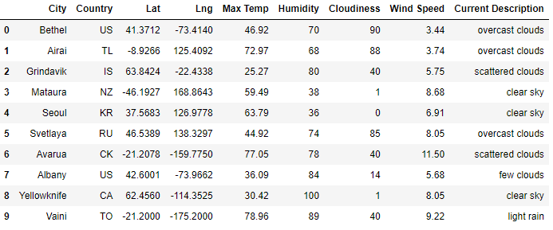

# World_Weather_Analysis
## Objective
The objective of this Challenge was to utilize API calls for weather and Google Maps data to present visualizations of information for a travel agency. The three parts of the challenge were to:
- Retrieve weather data
- Create a customer travel destinations map
- Create a travel itinerary map

## Results
### Retrieve weather data
Weather data was retrieved using the API from [OpenWeather](https://openweathermap.org/) based on a random set of 2,000 latitude and longitude combinations. Data concerning the current weather, latitude, longitude, country, maximum temperature, humidity, % cloud cover, and wind speed was collected for each city and stored in a dataframe. The header of the dataframe follows:

### Create a customer travel destinations map
Customer weather preferences were entered to search for potential travel destinations and hotels nearby where the range of acceptable maximum temperatures was between 75 and 90 degrees. Using Google Maps, each potential travel destination was populated on a heat map, with a marker layer for each city on the map that provided a pop-up with information on the closest hotel, city name, country, and the current weather and maximum temperature.

### Create a travel itinerary map
Finally, a travel itinerary was created by selecting four destinations in the same country, with a map showing the route to drive between the four cities (arriving back at the first city), as well as creating a map with a marker layer showing key information for each of the four destination cities.

Look out for emus! They fought a war (and lost!) against those big stupid birds.
